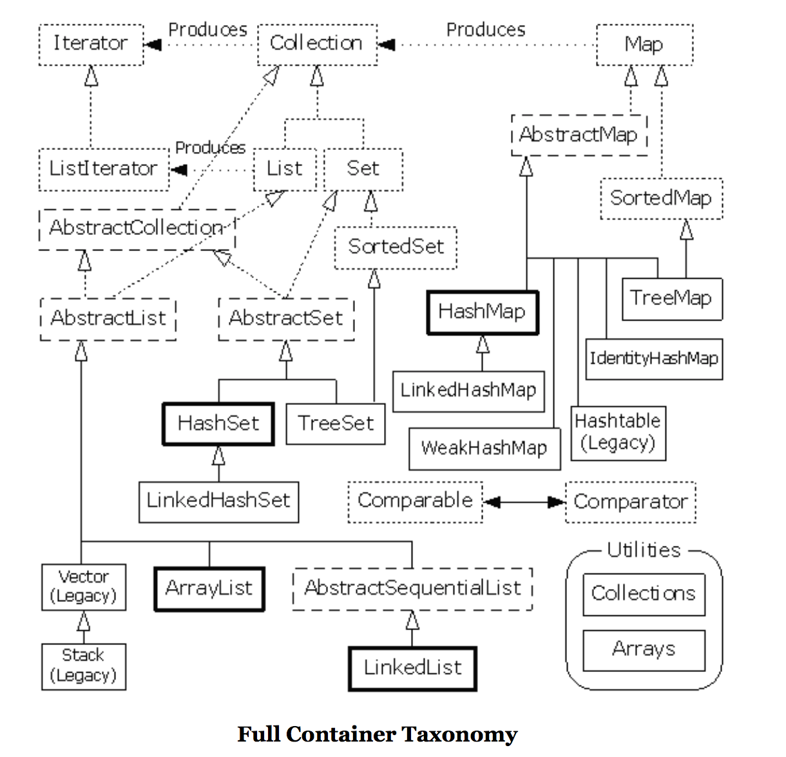

# Sun JDK集合包

关于集合的理解，需要从普通集合和能够支持并发的集合两个场景来进行，弄清楚每个典型的集合类的使用场景，每个集合的局限，以及和其他集合的比较。如何选择出合适的类来满足特定的需求，直接考验开发者的功底。

> 掌握这些类集合类的实现原理，以及在不同场景下的性能表现  

## 普通集合包

> 理解集合包，主要从Collection和Map接口进行理解，然后考虑它们的衍生类  
> Collection <-- List <-- (ArrayList, LinkedList, Vector, Stack)  
> Collection <-- Set <-- (HashSet, TreeSet)

> 集合集成全貌



### ArrayList

**需要注意一下几点：**  

* ArrayList是基于数组方式实现的，无容量的限制  
* ArrayList在执行插入元素时可能要扩容，在删除元素时并不会减小数组的容量（除非调用trimToSize()方法）  
* 在查找元素时要遍历数组，对于非null的元素采取equals的方式寻找  
* ArrayList是非线程安全的  
* add、get性能都不错，remove性能较差

### LinkedList

* LiinkedList基于双向链表机制实现  
* LinkedList在插入元素时，须创建一个新的Entry对象，并切换相应元素的前后元素引用  
* 在查找元素时，须遍历链表；在删除元素时，要遍历链表，找到要删除的元素，然后从链表上将元素删除即可  
* linkedList非线程安全的

### ArrayList vs. LinkedList
> 很多教材上面都都有如下的推断：
> [1]. 如果使用的List结构中，有频繁的remove动作，而get动作较少，推荐使用LinkedList  
> [2]. 如果有大量的get动作，而remove动作较少，推荐使用ArrayList
> 那么这些推断都是正确的吗？

我们来测试一下ArrayList 和 LinkedList随机removey以及get的效率，数据量分别为 10000、30000、50000、100000

**根据现象进行推理：**  
在随机执行remove的动作中，ArrayList的remove效率反而比LinkedList的效率高，是不是感觉很意外呢？为何会出现这种情况？理论上来说，LinkedList是基于链表的，删除只是需要修改一下指针的指向，而ArrayList是基于数组的，还有数组位置移动的时间代价，因而ArrayList的remove效率应该不如LinkedList

在随机执行get的动作中，ArrayList的get效率的确比LinkedList的效率高，原因是LinkedList每次执行get的时候，都是需要进行遍历寻找，这个耗时较为严重

**BUT**，请看下面的代码

```java

// 在LinkedList执行删除的时候，会执行如下代码来寻找Node<E>，该Node对象中包含了实际你add的对象

public E remove(int index) {
    checkElementIndex(index);
    return unlink(node(index));
}
    
Node<E> node(int index) {
    // assert isElementIndex(index);

    if (index < (size >> 1)) {
        Node<E> x = first;
        for (int i = 0; i < index; i++)
            x = x.next;
        return x;
    } else {
        Node<E> x = last;
        for (int i = size - 1; i > index; i--)
            x = x.prev;
        return x;
    }
}
```

**结论：**
LinkedList的remove操作，但就链表的指针指向动作，的确比ArrayList的数组拷贝要快速，但是LinkedList在node方法进行对象定位的过程中，时间损耗是很客观的

那么到底上述推断[1]，是不是就完全不正确了呢？其实不然，如果List在顺序进行remove的时候，ArrayList的remove效率非常的糟糕，LinkedList的remove效率此时的优势就体现出来了，还是上面的代码 *for (int i = 0; i < index; i++)* 只需要遍历一次，就能定位到Node<E>；如果是逆序进行remove，ArrayList 和 LinkedList在remove操作上的效率相差无几，ArrayList不用移动数组中的对象，LinkedList也只需要遍历一次就能定位到Node<E>， *for (int i = size - 1; i > index; i--)*

get操作可以用上述方式进行推论

**所以教科书上的东西，很多都是人云亦云，技术必须自己验证过，才放心使用。话有说回来，集合类的选用，应该追求实际的业务场景，追求一种平衡**

### Vector  

* Vector是基于**Synchronized**实现的线程安全的ArrayList，但在插入元素时容量扩充的机制和ArrayList稍有不同，并可通过传入capacityIncrement来控制容量的扩充（如果不传入capacityIncrement，则溢出时容量扩充为现有size的两倍）  

### Stack

* Stack基于Vector实现，支持LIFO

### HashSet

* HashSet基于HashMap实现，无容量限制  
* HashSet是非线程安全的  

### TreeSet

* TreeSet基于TreeMap实现，支持排序  
* TreeSet是非线程安全的  

### HashMap

HashMap非常的重要，要弄清楚它的实现原理  
**关键参数：**  
loadFactor，threshold，size=16 Entry[]  
**需要注意一下几点：**  
* HashMap采用数组方式存储key、value构成的Entry对象，无容量限制  
* HashMap基于key hash寻找Entry对象存放到数组的位置，对于hash冲突采用链表的方式来解决  
* Hash在插入元素时，可能会要扩大数组的容量，在扩大容量时需要重新计算hash，并复制对象到新的数组中  
* HashMap是非线程安全的  

### TreeMap

是一个典型的机遇红黑树的实现，因此它要求一定要有key比较的方法，要么掺入Comparator，要么key对象实现Comparable接口  
**要点：**  
* 基于红黑树实现，无容量限制  
* 是非线程安全的  

### 工具类

#### Collections

**需要掌握的api有：**
Collections.sort()  
Collections.copy()  
Collections.emptyXXX()  
Collections.max()  
Collections.min()  

#### Arrays

Arrays.asList()  
Arrays.sort()  
Arrays.parallelSort()  
Arrays.copyOf()